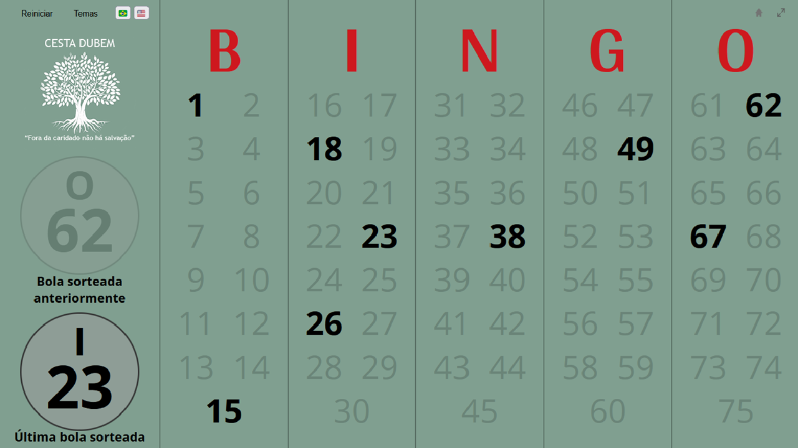

<a href="https://github.com/LeonDennis/bingo-cestadubem"><strong>Bingo Master Board - Cesta DuBem ver.</strong></a>

Este projeto, denomeado Bingo Master Board, fora editado e utilizado por mim mesmo como um auxiliar visual para os jogadores de um bingo presencial do grupo beneficente [__Cesta DuBem__](https://www.instagram.com/cesta_dubem/). O evento ocorreu com sucesso no dia 22/06/2026, em Guarujá-SP.

Dentro do evento e utilizando este projeto, a minha função foi a de preencher e exibir no telão os números sorteados pela apresentadora.

### Edições feitas em relação ao projeto original:
* Tema customizado com as cores do Cesta DuBem
* Traduções alternáveis entre PT-BR e EN
* Mostrar na tela a penúltima bola sorteada
* Pequena animação de vitória, ativada ao pressionar 'P'
* Todas as funções do projeto original ainda estão disponíveis.

Este fork foi usado e testado no Firefox, mas deve funcionar em outros navegadores (e via mobile).

Para mais informações sobre o projeto original, favor referir-se ao repositório do autor inicial.

## Como utilizá-lo:
To-do: Inserir este projeto no __GitHub Pages__.

Uso offline: Baixe o [__código-fonte__](https://github.com/LeonDennis/bingo-cestadubem/archive/refs/tags/proj.zip), extraia-o para seu dispositivo e abra o arquivo "index.html".

### Atalhos do teclado:
* __Space__: Sortear uma bola aleatória
* __R__: Reiniciar o jogo atual
* __F__: Deixar o programa em fullscreen
* __T__: Abrir o menu de temas
* __X__: Ocultar/mostrar os números sorteados
* __P__: Animação de vitória ("🎉 BINGO! 🎉")
* __Clicar na "bola sorteada anteriormente" limpa o número mostrado, e dar um duplo clique na última bola sorteada restaura a anterior.__

## License
Bingo Master Board (including this fork) is licensed under the MIT License.
